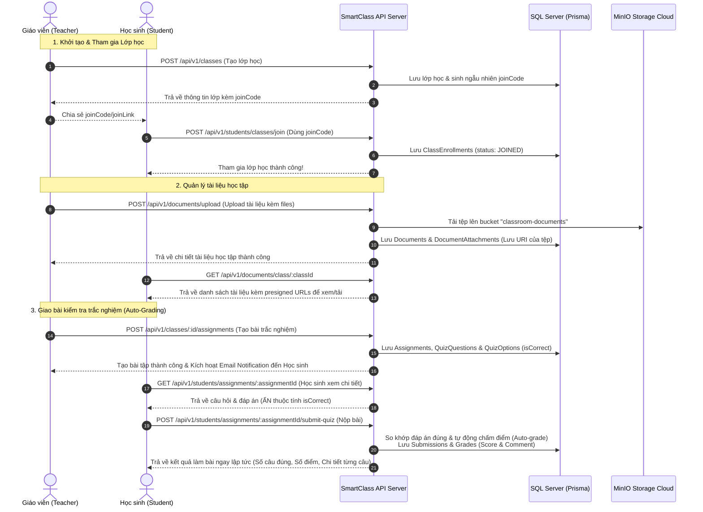

# 🎓 SmartClass API - Tài Liệu API Hệ Thống Quản Lý Lớp Học Học Tập

Chào mừng bạn đến với tài liệu API chi tiết của hệ thống quản lý lớp học **SmartClass**. Hệ thống cung cấp các giải pháp quản lý lớp học trực tuyến, giao bài tập tự luận và trắc nghiệm (tự động chấm điểm), chia sẻ tài liệu học tập, theo dõi tiến độ và bảng điểm tổng hợp dành cho Giáo viên (`teacher`) và Học sinh (`student`).

Tài liệu này được biên soạn đầy đủ và chi tiết dựa trên mã nguồn thực tế của Backend, giúp lập trình viên Frontend dễ dàng tích hợp và phát triển ứng dụng.

---

## 🛠️ Thiết Kế Kiến Trúc & Luồng Hệ Thống

Dưới đây là sơ đồ luồng hoạt động chính giữa Giáo viên, Học sinh và Hệ thống SmartClass:



---

## 📌 Quy Tắc Chung Của API

### 1. Thông Tin Kết Nối (Base URL)
- **Cấu hình mặc định**: `http://localhost:5000/api/v1`
- Định dạng dữ liệu gửi lên và nhận về: **JSON** (ngoại trừ các endpoint tải lên tệp tin sử dụng `multipart/form-data`).

### 2. Xác Thực & Phân Quyền (Authentication & Authorization)
Hệ thống sử dụng cơ chế xác thực kép bằng cặp mã thông báo **JWT (JSON Web Token)**:
- **Access Token**: Đính kèm trong Header của mọi request yêu cầu xác thực theo định dạng:
  ```http
  Authorization: Bearer <your_access_token>
  ```
- **Refresh Token**: Được lưu trữ dưới dạng Cookie an toàn phía máy khách (**HttpOnly, SameSite=Strict, Secure**). Được dùng để cấp lại Access Token mới tự động.
- **Vai trò người dùng (Roles)**: Gồm 2 vai trò chính:
  1. `teacher` (Giáo viên): Có toàn quyền quản lý lớp học, đăng tài liệu, giao bài tập, chấm điểm tự luận, xóa học sinh.
  2. `student` (Học sinh): Được tham gia lớp học qua mã, xem tài liệu, làm bài tập tự luận/trắc nghiệm và xem bảng điểm của mình.

### 3. Trạng Thái Lớp Học (Classroom Status)
Lớp học có 2 trạng thái chính: `ACTIVE` (Đang hoạt động) và `ENDED` (Đã kết thúc).
- Khi lớp học chuyển sang trạng thái `ENDED`, **mọi hoạt động ghi/sửa đổi dữ liệu đều bị khóa** (bao gồm: thêm học sinh, cập nhật lớp học, giao bài tập mới, nộp bài tập, upload/update/delete tài liệu).
- Các API lấy dữ liệu (GET) vẫn hoạt động bình thường để phục vụ việc xem lại lịch sử học tập.

### 4. Quy Định Tải Lên Tệp Tin (File Upload)
- **Định dạng tệp hỗ trợ**: PDF, Word (`.docx`), hình ảnh (`.jpeg`, `.png`), tệp nén (`.zip`), bảng tính Excel (`.xls`, `.xlsx`), tệp văn bản thuần (`.txt`).
- **Giới hạn dung lượng**: Tối đa **25 MB** trên mỗi tệp tin.
- **Giới hạn số lượng**: Tối đa **10 tệp tin** cho mỗi lần tải lên.
- Đặt tên trường tải lên (FieldName):
  - Tài liệu: `files`
  - Bài tập / Bài nộp: `attachments`

### 5. Định Dạng Phản Hồi Chuẩn (Standard Response Format)

#### Phản hồi Thành công (Success Response)
```json
{
  "success": true,
  "message": "Thông điệp mô tả hành động thành công (nếu có)",
  "data": { ... } // Đối tượng hoặc mảng dữ liệu trả về
}
```

#### Phản hồi Lỗi (Error Response)
```json
{
  "success": false,
  "message": "Chi tiết thông điệp báo lỗi cụ thể cho người dùng",
  "code": "MÃ_LỖI_HỆ_THỐNG", // Ví dụ: BAD_REQUEST, UNAUTHORIZED, FORBIDDEN, NOT_FOUND, CONFLICT, VALIDATION_ERROR
  "errors": [] // Danh sách chi tiết các trường bị lỗi validator (nếu có)
}
```

---

## 📂 Danh Sách Các API Chi Tiết

### 🔑 Nhóm 1: Xác Thực & Tài Khoản (`/api/v1/auth`)

#### 1. Đăng ký tài khoản (`POST /register`)
- **Mô tả**: Tạo tài khoản mới cho học sinh hoặc giáo viên.
- **Access Control**: Tự do truy cập công khai.
- **Body (JSON)**:
  | Tên trường | Kiểu dữ liệu | Bắt buộc | Mô tả |
  | :--- | :--- | :--- | :--- |
  | `name` | string | Có | Tên hiển thị (từ 2 đến 255 ký tự, không được trống). |
  | `email` | string | Có | Email đăng ký (đúng định dạng email, tối đa 255 ký tự). |
  | `password` | string | Có | Mật khẩu (từ 7 đến 20 ký tự). |
  | `role` | string | Có | Vai trò tài khoản: chỉ chọn `"student"` hoặc `"teacher"`. |

- **Phản hồi thành công (201 Created)**:
  ```json
  {
    "success": true,
    "message": "Đăng ký thành công!",
    "data": {
      "user": {
        "userId": "3c7b74bd-12c8-47bc-ad74-297eb0be5132",
        "name": "Trần Văn Học",
        "email": "student1@gmail.com",
        "role": "student"
      }
    }
  }
  ```
- **Lỗi thường gặp**:
  - `409 CONFLICT` (Email đã tồn tại):
    ```json
    { "success": false, "message": "Email này đã được đăng ký!", "code": "CONFLICT", "errors": [] }
    ```
  - `422 VALIDATION_ERROR` (Thiếu hoặc sai validator định dạng trường).

---

#### 2. Đăng nhập hệ thống (`POST /login`)
- **Mô tả**: Kiểm tra thông tin tài khoản và thiết lập phiên đăng nhập.
- **Cơ chế khóa bảo mật**: Đăng nhập sai quá 5 lần liên tiếp trong 15 phút sẽ tạm khóa tài khoản.
- **Access Control**: Tự do truy cập công khai.
- **Body (JSON)**:
  | Tên trường | Kiểu dữ liệu | Bắt buộc | Mô tả |
  | :--- | :--- | :--- | :--- |
  | `email` | string | Có | Email tài khoản đã đăng ký. |
  | `password` | string | Có | Mật khẩu tài khoản (tối đa 20 ký tự). |

- **Phản hồi thành công (200 OK)**:
  - Thiết lập Cookie: `refreshToken=<token>; HttpOnly; SameSite=Strict; Max-Age=7 days; Secure (nếu là production)`
  - Body:
    ```json
    {
      "success": true,
      "message": "Đăng nhập thành công!",
      "data": {
        "accessToken": "eyJhbGciOiJIUzI1NiIsInR5cCI6IkpXVCJ9.eyJ1c2VySWQiOiIzYydiNzRiZC0xMmM4LTQ3YmMtYWQ3NC0yOTdlYjBiZTUxMzIiLCJyb2xlIjoic3R1ZGVudCIsImlhdCI6MTc4NDQ5NjAwMCwiZXhwIjoxNzg0NTA2ODAwfQ...",
        "user": {
          "userId": "3c7b74bd-12c8-47bc-ad74-297eb0be5132",
          "name": "Trần Văn Học",
          "email": "student1@gmail.com",
          "role": "student"
        }
      }
    }
    ```
- **Lỗi thường gặp**:
  - `401 UNAUTHORIZED` (Sai thông tin đăng nhập):
    ```json
    { "success": false, "message": "Email hoặc mật khẩu không đúng! Bạn còn 4 lần thử.", "code": "UNAUTHORIZED", "errors": [] }
    ```
  - `429 TOO_MANY_REQUESTS` (Tài khoản bị khóa tạm thời):
    ```json
    { "success": false, "message": "Tài khoản đã bị tạm khóa do đăng nhập sai quá 5 lần. Vui lòng thử lại sau 15 phút.", "code": "TOO_MANY_REQUESTS", "errors": [] }
    ```

---

#### 3. Làm mới Access Token (`POST /refresh-token`)
- **Mô tả**: Tạo Access Token mới khi token cũ hết hạn (sử dụng Refresh Token lưu trong Cookie).
- **Access Control**: Yêu cầu Cookie chứa `refreshToken` hợp lệ.
- **Phản hồi thành công (200 OK)**:
  ```json
  {
    "success": true,
    "data": {
      "accessToken": "new-access-token-string"
    }
  }
  ```
- **Lỗi thường gặp**:
  - `401 UNAUTHORIZED` (Refresh token thiếu hoặc hết hạn):
    ```json
    { "success": false, "message": "Refresh token không hợp lệ hoặc đã hết hạn!", "code": "UNAUTHORIZED", "errors": [] }
    ```

---

#### 4. Đăng xuất (`POST /logout`)
- **Mô tả**: Hủy phiên đăng nhập, xóa Refresh Token khỏi DB/Redis và xóa cookie phía Client.
- **Access Control**: Đăng nhập (Yêu cầu gửi Access Token trong Header + Cookie `refreshToken`).
- **Phản hồi thành công (200 OK)**:
  ```json
  {
    "success": true,
    "message": "Đăng xuất thành công!"
  }
  ```

---

### 👤 Nhóm 2: Người Dùng (`/api/v1/users`)

#### 1. Lấy danh sách toàn bộ người dùng (`GET /`)
- **Mô tả**: Lấy danh sách người dùng trong hệ thống (chủ yếu dùng cho quản trị viên hoặc tích hợp hệ thống).
- **Phản hồi thành công (200 OK)**:
  ```json
  {
    "success": true,
    "data": [
      {
        "userId": "uuid-1",
        "name": "Nguyễn Văn A",
        "email": "teacherA@gmail.com",
        "role": "teacher"
      },
      {
        "userId": "uuid-2",
        "name": "Trần Thị B",
        "email": "studentB@gmail.com",
        "role": "student"
      }
    ]
  }
  ```

---

#### 2. Lấy thông tin người dùng cụ thể (`GET /:id`)
- **Mô tả**: Xem thông tin chi tiết của một tài khoản theo ID người dùng.
- **Path Parameter**: `id` - ID của người dùng cần tra cứu.
- **Phản hồi thành công (200 OK)**:
  ```json
  {
    "success": true,
    "data": {
      "userId": "uuid-1",
      "name": "Nguyễn Văn A",
      "email": "teacherA@gmail.com",
      "role": "teacher"
    }
  }
  ```
- **Lỗi thường gặp**:
  - `404 NOT_FOUND`: Không tìm thấy người dùng.

---

### 🏫 Nhóm 3: Lớp Học (`/api/v1/classes`)

#### 1. Lấy danh sách lớp học (`GET /`)
- **Mô tả**: Lấy danh sách toàn bộ lớp học của tài khoản hiện tại.
  - **Giáo viên**: Trả về các lớp do chính mình tạo ra kèm sĩ số học sinh (`totalStudents`).
  - **Học sinh**: Trả về các lớp đã tham gia thành công.
- **Access Control**: Đăng nhập (Yêu cầu Access Token).
- **Query Parameter**:
  - `search` (string, tùy chọn): Tìm kiếm lớp học theo tên lớp.
- **Phản hồi thành công (200 OK - Với vai trò Giáo viên)**:
  ```json
  {
    "success": true,
    "message": "Lấy danh sách lớp học thành công!",
    "data": [
      {
        "classId": "class-uuid-1",
        "teacherId": "teacher-uuid-123",
        "className": "Lập trình Node.js K18",
        "description": "Lớp học lập trình Backend cơ bản đến nâng cao",
        "room": "Phòng thực hành 403",
        "topic": "Công nghệ thông tin",
        "joinCode": "NJS83H",
        "joinLink": null,
        "status": "ACTIVE",
        "createdAt": "2026-06-14T00:15:30.000Z",
        "totalStudents": 42
      }
    ]
  }
  ```

---

#### 2. Tạo lớp học mới (`POST /`)
- **Mô tả**: Giáo viên khởi tạo một lớp học mới. Hệ thống sẽ tự động phát sinh mã tham gia `joinCode` ngẫu nhiên gồm 6 ký tự viết hoa và số.
- **Access Control**: Đăng nhập + Chỉ Giáo viên (`teacher`).
- **Body (JSON)**:
  | Tên trường | Kiểu dữ liệu | Bắt buộc | Mô tả |
  | :--- | :--- | :--- | :--- |
  | `className` | string | Có | Tên lớp học (từ 1 đến 100 ký tự). |
  | `description` | string | Không | Mô tả ngắn gọn về lớp học (tối đa 500 ký tự). |
  | `room` | string | Không | Tên phòng học vật lý (tối đa 50 ký tự). |
  | `topic` | string | Không | Chủ đề hoặc môn học (tối đa 100 ký tự). |

- **Phản hồi thành công (201 Created)**:
  ```json
  {
    "success": true,
    "message": "Tạo lớp học thành công!",
    "data": {
      "classId": "class-uuid-999",
      "teacherId": "teacher-uuid-123",
      "className": "Lập trình Node.js K18",
      "description": "Lớp học lập trình Backend cơ bản đến nâng cao",
      "room": "Phòng thực hành 403",
      "topic": "Công nghệ thông tin",
      "joinCode": "NJS83H",
      "joinLink": null,
      "status": "ACTIVE",
      "createdAt": "2026-06-14T07:15:00.000Z"
    }
  }
  ```

---

#### 3. Lấy chi tiết lớp học (`GET /:id`)
- **Mô tả**: Lấy thông tin cơ bản của lớp học cụ thể theo ID.
- **Path Parameter**: `id` - ID lớp học.
- **Access Control**: Đăng nhập.
- **Phản hồi thành công (200 OK)**:
  ```json
  {
    "success": true,
    "message": "Lấy chi tiết lớp học thành công!",
    "data": {
      "classId": "class-uuid-999",
      "teacherId": "teacher-uuid-123",
      "className": "Lập trình Node.js K18",
      "description": "Lớp học lập trình Backend cơ bản đến nâng cao",
      "room": "Phòng thực hành 403",
      "topic": "Công nghệ thông tin",
      "joinCode": "NJS83H",
      "joinLink": null,
      "status": "ACTIVE",
      "createdAt": "2026-06-14T07:15:00.000Z"
    }
  }
  ```

---

#### 4. Lấy bảng tin lớp học (`GET /:id/stream`)
- **Mô tả**: Lấy toàn bộ bài viết trên bảng tin lớp học bao gồm **Tài liệu** và **Bài tập** được xếp theo thứ tự thời gian tạo giảm dần.
- **Path Parameter**: `id` - ID lớp học.
- **Access Control**: Đăng nhập (Phải thuộc lớp học đó).
- **Cơ chế đặc biệt**: Hệ thống tự động sinh các liên kết xem trực tiếp (`fileUrl`) và liên kết tải xuống an toàn (`downloadUrl`) của các file đính kèm thông qua dịch vụ lưu trữ đám mây MinIO.
- **Phản hồi thành công (200 OK)**:
  ```json
  {
    "success": true,
    "message": "Lấy bảng tin lớp học thành công!",
    "data": [
      {
        "id": "doc-uuid-101",
        "documentId": "doc-uuid-101",
        "type": "document",
        "title": "Tài liệu lý thuyết luồng tuần 1",
        "description": "Các bạn đọc kỹ tài liệu trước khi lên lớp.",
        "createdAt": "2026-06-14T08:00:00.000Z",
        "uploadTime": "2026-06-14T08:00:00.000Z",
        "DocumentAttachments": [
          {
            "attachmentId": "att-doc-001",
            "documentId": "doc-uuid-101",
            "fileName": "slide-node-t1.pdf",
            "fileUrl": "http://localhost:9000/classroom-documents/slide-node-t1.pdf?X-Amz-Algorithm=...",
            "downloadUrl": "http://localhost:9000/classroom-documents/slide-node-t1.pdf?response-content-disposition=attachment...",
            "fileSize": "4857600",
            "uploadedAt": "2026-06-14T08:00:00.000Z"
          }
        ]
      },
      {
        "id": "assign-uuid-202",
        "assignmentId": "assign-uuid-202",
        "type": "assignment",
        "title": "Bài tập trắc nghiệm Node.js cơ bản",
        "description": "Hoàn thành trước hạn.",
        "createdAt": "2026-06-14T07:30:00.000Z",
        "deadline": "2026-06-20T23:59:00.000Z",
        "status": "ACTIVE",
        "typeAssignment": "MULTIPLE_CHOICE",
        "AssignmentAttachments": [],
        "totalSubmissions": 12
      }
    ]
  }
  ```

---

#### 5. Lấy danh sách học sinh trong lớp (`GET /:id/students`)
- **Mô tả**: Giáo viên lấy danh sách toàn bộ học sinh đã tham gia lớp học.
- **Path Parameter**: `id` - ID lớp học.
- **Access Control**: Đăng nhập + Chỉ Giáo viên quản lý lớp (`teacher`).
- **Phản hồi thành công (200 OK)**:
  ```json
  {
    "success": true,
    "message": "Lấy danh sách học sinh thành công!",
    "data": [
      {
        "enrollmentId": "enroll-uuid-001",
        "joinTime": "2026-06-14T02:00:00.000Z",
        "status": "JOINED",
        "student": {
          "userId": "student-uuid-99",
          "name": "Nguyễn Văn B",
          "email": "vanb@gmail.com",
          "role": "student"
        }
      }
    ]
  }
  ```

---

#### 6. Xóa học sinh khỏi lớp (`DELETE /:id/students/:studentId`)
- **Mô tả**: Giáo viên trục xuất một học sinh ra khỏi lớp học. Học sinh đó sẽ bị xóa quyền xem tài liệu, bài tập của lớp này.
- **Path Parameters**:
  - `id`: ID lớp học.
  - `studentId`: ID học sinh cần trục xuất.
- **Access Control**: Đăng nhập + Chỉ Giáo viên quản lý lớp (`teacher`) + Lớp học phải đang hoạt động (`ACTIVE`).
- **Phản hồi thành công (200 OK)**:
  ```json
  {
    "success": true,
    "message": "Đã xóa học sinh khỏi lớp thành công!"
  }
  ```

---

#### 7. Cập nhật thông tin lớp học (`PUT /:id`)
- **Mô tả**: Cập nhật các trường thông tin của lớp học hoặc đóng lớp học (`status = "ENDED"`).
- **Path Parameter**: `id` - ID lớp học.
- **Access Control**: Đăng nhập + Chỉ Giáo viên quản lý lớp (`teacher`).
- **Lưu ý**: Nếu lớp học đã đóng (`status = "ENDED"`), chỉ có duy nhất hoạt động cập nhật trạng thái lớp học trở lại `ACTIVE` là được chấp nhận, các cập nhật thông tin khác sẽ bị khóa.
- **Body (JSON)**:
  | Tên trường | Kiểu dữ liệu | Bắt buộc | Mô tả |
  | :--- | :--- | :--- | :--- |
  | `className` | string | Không | Tên lớp học mới. |
  | `description` | string | Không | Mô tả lớp học mới. |
  | `room` | string | Không | Phòng học mới. |
  | `topic` | string | Không | Chủ đề mới. |
  | `status` | string | Không | Trạng thái lớp học: `"ACTIVE"` hoặc `"ENDED"`. |

- **Phản hồi thành công (200 OK)**:
  ```json
  {
    "success": true,
    "message": "Cập nhật lớp học thành công!",
    "data": {
      "classId": "class-uuid-999",
      "teacherId": "teacher-uuid-123",
      "className": "Lập trình Node.js nâng cao K18",
      "status": "ACTIVE",
      ...
    }
  }
  ```

---

#### 8. Xóa lớp học (`DELETE /:id`)
- **Mô tả**: Xóa hoàn toàn một lớp học khỏi hệ thống.
- **Path Parameter**: `id` - ID lớp học cần xóa.
- **Access Control**: Đăng nhập + Chỉ Giáo viên quản lý lớp (`teacher`) + Lớp học phải đang hoạt động (`ACTIVE`).
- **Phản hồi thành công (200 OK)**:
  ```json
  {
    "success": true,
    "message": "Xóa lớp học thành công!"
  }
  ```

---

#### 9. Lấy bảng điểm tổng hợp của lớp học (`GET /:id/grades`)
- **Mô tả**: Lấy dữ liệu điểm số của tất cả học sinh trong lớp để lập thành bảng điểm học tập tổng hợp.
- **Path Parameter**: `id` - ID lớp học.
- **Access Control**: Đăng nhập + Chỉ Giáo viên quản lý lớp (`teacher`).
- **Quy tắc tính điểm tự động**:
  - Đối với bài nộp trắc nghiệm: Điểm được hệ thống chấm tự động và đưa vào bảng.
  - Đối với học sinh **không nộp bài mà bài tập đã quá hạn (deadline)**: Hệ thống sẽ tự động điền **0 điểm** kèm chú thích `"Không nộp bài"` và đặt trạng thái `"absent"`.
  - Hệ thống tính Điểm trung bình (`averageScore`) của từng học sinh: Chỉ tính trên các đầu điểm đã chấm (bao gồm cả điểm 0 của trạng thái `absent`), bỏ qua các bài tập chưa tới hạn hoặc chưa nộp nhưng còn hạn.
- **Phản hồi thành công (200 OK)**:
  ```json
  {
    "success": true,
    "message": "Lấy danh sách điểm số lớp học thành công!",
    "data": {
      "assignments": [
        {
          "assignmentId": "assign-uuid-201",
          "title": "Bài tập tự luận tuần 1",
          "deadline": "2026-06-12T23:59:00.000Z"
        },
        {
          "assignmentId": "assign-uuid-202",
          "title": "Bài tập trắc nghiệm cơ bản",
          "deadline": "2026-06-25T23:59:00.000Z"
        }
      ],
      "students": [
        {
          "studentId": "student-uuid-99",
          "name": "Nguyễn Văn B",
          "email": "vanb@gmail.com",
          "grades": [
            {
              "assignmentId": "assign-uuid-201",
              "title": "Bài tập tự luận tuần 1",
              "score": 0,
              "comment": "Không nộp bài",
              "gradedAt": null,
              "status": "absent"
            },
            {
              "assignmentId": "assign-uuid-202",
              "title": "Bài tập trắc nghiệm cơ bản",
              "score": 8.5,
              "comment": "Hệ thống chấm tự động: Đúng 17/20 câu.",
              "gradedAt": "2026-06-14T03:10:00.000Z",
              "status": "graded"
            }
          ],
          "averageScore": 4.25
        }
      ]
    }
  }
  ```

---

### 📂 Nhóm 4: Tài Liệu Học Tập (`/api/v1/documents`)

#### 1. Đăng tải tài liệu mới (`POST /upload`)
- **Mô tả**: Giáo viên đăng bài viết đính kèm các tệp tài liệu học tập (bài giảng, sách điện tử...) lên lớp học.
- **Request Type**: `multipart/form-data`
- **Access Control**: Đăng nhập + Chỉ Giáo viên quản lý lớp (`teacher`) + Lớp học phải đang hoạt động (`ACTIVE`).
- **Body**:
  | Tên trường | Kiểu dữ liệu | Bắt buộc | Mô tả |
  | :--- | :--- | :--- | :--- |
  | `classId` | string | Có | ID lớp học muốn chia sẻ tài liệu. |
  | `title` | string | Có | Tiêu đề bài viết tài liệu (từ 1 đến 255 ký tự). |
  | `description` | string | Không | Mô tả hoặc nội dung chi tiết bài đăng (tối đa 2000 ký tự). |
  | `files` | File[] | Có | Mảng các file đính kèm (ít nhất 1 file, tối đa 10 files, giới hạn 25MB/file). |

- **Phản hồi thành công (201 Created)**:
  ```json
  {
    "success": true,
    "message": "Tải tài liệu lên thành công.",
    "data": {
      "documentId": "doc-uuid-888",
      "classId": "class-uuid-999",
      "title": "Bài giảng Chương 1: Giới thiệu lập trình",
      "description": "Các bạn xem slide và làm bài tập đọc thêm.",
      "uploadTime": "2026-06-14T08:30:00.000Z",
      "DocumentAttachments": [
        {
          "attachmentId": "att-doc-8801",
          "documentId": "doc-uuid-888",
          "fileName": "chuong1.pdf",
          "fileUri": "classroom-documents/uuid-chuong1.pdf",
          "fileSize": "1205630",
          "uploadedAt": "2026-06-14T08:30:00.000Z"
        }
      ]
    }
  }
  ```

---

#### 2. Lấy danh sách tài liệu của lớp học (`GET /class/:classId`)
- **Mô tả**: Xem tất cả các bài tài liệu đã đăng trong một lớp cụ thể.
- **Path Parameter**: `classId` - ID lớp học.
- **Access Control**: Đăng nhập (Phải là Giáo viên lớp học hoặc Học sinh đã tham gia lớp học).
- **Phản hồi thành công (200 OK)**:
  ```json
  {
    "success": true,
    "data": [
      {
        "documentId": "doc-uuid-888",
        "classId": "class-uuid-999",
        "title": "Bài giảng Chương 1: Giới thiệu lập trình",
        "description": "Các bạn xem slide và làm bài tập đọc thêm.",
        "uploadTime": "2026-06-14T08:30:00.000Z",
        "DocumentAttachments": [
          {
            "attachmentId": "att-doc-8801",
            "fileName": "chuong1.pdf",
            "fileUri": "classroom-documents/uuid-chuong1.pdf",
            "fileSize": "1205630",
            "uploadedAt": "2026-06-14T08:30:00.000Z"
          }
        ]
      }
    ]
  }
  ```

---

#### 3. Lấy đường dẫn tải tệp tin (`GET /attachment/:attachmentId/download`)
- **Mô tả**: Sinh đường dẫn presigned URL an toàn có thời hạn từ MinIO để tải hoặc xem tệp tài liệu.
- **Path Parameter**: `attachmentId` - ID của tệp đính kèm.
- **Query Parameter**:
  - `action` (string, tùy chọn): Truyền giá trị `"download"` để ép trình duyệt tải tệp xuống trực tiếp thay vì mở xem trực tiếp trên tab mới.
- **Access Control**: Đăng nhập (Phải thuộc lớp học chứa tài liệu này).
- **Phản hồi thành công (200 OK)**:
  ```json
  {
    "success": true,
    "data": "http://minio-server-ip:9000/classroom-documents/uuid-chuong1.pdf?X-Amz-Algorithm=AWS4-HMAC-SHA256&X-Amz-Credential=..."
  }
  ```

---

#### 4. Chỉnh sửa bài tài liệu (`PUT /:documentId`)
- **Mô tả**: Giáo viên cập nhật tiêu đề, mô tả hoặc sửa đổi danh sách tệp đính kèm của bài tài liệu học tập.
- **Request Type**: `multipart/form-data`
- **Path Parameter**: `documentId` - ID tài liệu học tập.
- **Access Control**: Đăng nhập + Chỉ Giáo viên sở hữu lớp (`teacher`) + Lớp học phải đang hoạt động (`ACTIVE`).
- **Body**:
  - `title` (string, tùy chọn): Tiêu đề mới (không được để trống).
  - `description` (string, tùy chọn): Mô tả mới.
  - `keepAttachmentIds` (mảng string hoặc chuỗi JSON, tùy chọn): Danh sách ID các tệp đính kèm cũ muốn giữ lại. Các tệp đính kèm cũ không có ID trong danh sách này sẽ bị tự động xóa khỏi DB và hệ thống MinIO.
  - `files` (File[], tùy chọn): Tải lên thêm các tệp đính kèm mới.
- **Phản hồi thành công (200 OK)**:
  ```json
  {
    "success": true,
    "message": "Cập nhật tài liệu thành công.",
    "data": {
      "documentId": "doc-uuid-888",
      "title": "Bài giảng Chương 1: Cập nhật mới",
      "description": "Slide bài giảng đã được cập nhật sơ đồ.",
      "uploadTime": "2026-06-14T08:30:00.000Z",
      "DocumentAttachments": [
        {
          "attachmentId": "att-doc-8801", // File cũ được giữ lại
          "fileName": "chuong1.pdf",
          "fileUri": "classroom-documents/uuid-chuong1.pdf",
          "fileSize": "1205630"
        },
        {
          "attachmentId": "att-doc-8899", // File mới tải lên thêm
          "fileName": "so-do-phu-luc.png",
          "fileUri": "classroom-documents/uuid-so-do-phu-luc.png",
          "fileSize": "350200"
        }
      ]
    }
  }
  ```

---

#### 5. Xóa bài tài liệu (`DELETE /:documentId`)
- **Mô tả**: Xóa hoàn toàn bài đăng tài liệu học tập và tất cả tệp tin liên kết trên MinIO.
- **Path Parameter**: `documentId` - ID tài liệu cần xóa.
- **Access Control**: Đăng nhập + Chỉ Giáo viên sở hữu lớp (`teacher`) + Lớp học phải đang hoạt động (`ACTIVE`).
- **Phản hồi thành công (200 OK)**:
  ```json
  {
    "success": true,
    "message": "Xóa tài liệu thành công."
  }
  ```

---

### 📊 Nhóm 5: Giáo Viên - Dashboard (`/api/v1/dashboard`)

#### 1. Lấy toàn bộ thông tin Dashboard giáo viên (`GET /`)
- **Mô tả**: Tải đồng thời tất cả dữ liệu thống kê tổng hợp phục vụ giao diện trang chủ giáo viên (sử dụng mẫu thiết kế Facade để tối ưu hóa hiệu suất gọi DB).
- **Access Control**: Đăng nhập + Chỉ Giáo viên (`teacher`).
- **Query Parameter**:
  - `limit` (number, tùy chọn, mặc định 10): Giới hạn số lượng bài nộp chưa chấm hiển thị trên danh sách.
- **Phản hồi thành công (200 OK)**:
  ```json
  {
    "success": true,
    "data": {
      "stats": {
        "totalClasses": 4, // Tổng số lớp dạy
        "totalStudents": 156, // Tổng số học sinh không trùng lặp
        "pendingGrades": 8 // Tổng số bài tự luận nộp chưa được chấm điểm
      },
      "classes": [
        {
          "classId": "class-1",
          "className": "Lớp Toán học đại cương",
          "joinCode": "MTH101",
          "status": "ACTIVE",
          "studentCount": 38,
          "assignmentCount": 5,
          "createdAt": "2026-06-10T..."
        }
      ],
      "pendingSubmissions": [
        {
          "submissionId": "sub-uuid-11",
          "assignmentId": "assign-uuid-99",
          "assignmentTitle": "Bài tập Đạo hàm ứng dụng",
          "assignmentType": "ESSAY",
          "classId": "class-1",
          "className": "Lớp Toán học đại cương",
          "studentId": "stud-uuid-12",
          "studentName": "Trần Thị Lan",
          "studentEmail": "lan@gmail.com",
          "submittedAt": "2026-06-13T22:10:00.000Z"
        }
      ],
      "upcomingAssignments": [
        {
          "assignmentId": "assign-uuid-98",
          "title": "Kiểm tra Tích phân",
          "classId": "class-1",
          "className": "Lớp Toán học đại cương",
          "deadline": "2026-06-15T23:59:00.000Z",
          "typeAssignment": "ESSAY",
          "totalSubmissions": 15,
          "urgency": "urgent" // "urgent" nếu hạn nộp còn dưới 2 ngày, ngược lại "upcoming"
        }
      ],
      "recentActivities": [
        {
          "submissionId": "sub-uuid-11",
          "studentName": "Trần Thị Lan",
          "assignmentTitle": "Bài tập Đạo hàm ứng dụng",
          "className": "Lớp Toán học đại cương",
          "submittedAt": "2026-06-13T22:10:00.000Z"
        }
      ]
    }
  }
  ```

---

#### 2. Lấy số liệu thống kê nhanh (`GET /stats`)
- **Mô tả**: Chỉ trả về số liệu đếm số lớp, học sinh và bài chưa chấm để cập nhật nóng các widget số liệu trên giao diện.
- **Access Control**: Đăng nhập + Chỉ Giáo viên (`teacher`).
- **Phản hồi thành công (200 OK)**:
  ```json
  {
    "success": true,
    "data": {
      "totalClasses": 4,
      "totalStudents": 156,
      "pendingGrades": 8
    }
  }
  ```

---

#### 3. Lấy danh sách bài nộp chưa chấm có phân trang (`GET /submissions-to-grade`)
- **Mô tả**: Lấy danh sách bài tập tự luận của học sinh nộp lên chưa được chấm điểm, hỗ trợ phân trang phục vụ màn hình quản lý chấm bài tập.
- **Access Control**: Đăng nhập + Chỉ Giáo viên (`teacher`).
- **Query Parameters**:
  - `page` (number, tùy chọn, mặc định 1): Số trang cần lấy.
  - `limit` (number, tùy chọn, mặc định 10): Số bản ghi trên mỗi trang.
- **Phản hồi thành công (200 OK)**:
  ```json
  {
    "success": true,
    "data": {
      "total": 8,
      "page": 1,
      "limit": 10,
      "totalPages": 1,
      "submissions": [
        {
          "submissionId": "sub-uuid-11",
          "assignmentId": "assign-uuid-99",
          "assignmentTitle": "Bài tập Đạo hàm ứng dụng",
          "assignmentType": "ESSAY",
          "classId": "class-1",
          "className": "Lớp Toán học đại cương",
          "studentId": "stud-uuid-12",
          "studentName": "Trần Thị Lan",
          "studentEmail": "lan@gmail.com",
          "submittedAt": "2026-06-13T22:10:00.000Z",
          "attachments": [
            {
              "attachmentId": "att-sub-01",
              "fileName": "bai_lam_dao_ham.docx",
              "fileUrl": "http://localhost:9000/classroom-submissions/bai_lam_dao_ham.docx?X-Amz-...",
              "downloadUrl": "http://localhost:9000/classroom-submissions/bai_lam_dao_ham.docx?response-content-disposition=...",
              "fileSize": "1543000"
            }
          ]
        }
      ]
    }
  }
  ```

---

### 🎓 Nhóm 6: Học Sinh - Lớp Học, Bài Tập & Nộp Bài (`/api/v1/students`)
Các API trong nhóm này chỉ cho phép Học sinh (`student`) truy cập.

#### 1. Lấy tổng quan Dashboard học sinh (`GET /dashboard`)
- **Mô tả**: Tải dữ liệu trang chủ học sinh (Thống kê số lượng bài, lớp học đã tham gia, bảng điểm nhận được gần nhất, bài tập sắp tới hạn, lịch sử hoạt động).
- **Phản hồi thành công (200 OK)**:
  ```json
  {
    "success": true,
    "message": "Lấy dữ liệu Dashboard thành công!",
    "data": {
      "stats": {
        "totalClasses": 3,
        "totalAssignments": 12,
        "submittedCount": 9,
        "pendingAssignments": 3 // Bài tập còn nợ (được tính bằng tổng số bài giao trừ đi bài đã nộp)
      },
      "classes": [
        {
          "classId": "class-uuid-1",
          "className": "Lập trình Node.js K18",
          "teacherName": "Nguyễn Văn A",
          "studentCount": 42,
          "assignmentCount": 6,
          "createdAt": "2026-06-14T..."
        }
      ],
      "recentGrades": [
        {
          "submissionId": "sub-uuid-88",
          "assignmentId": "assign-uuid-201",
          "assignmentTitle": "Bài tập tự luận tuần 1",
          "classId": "class-uuid-1",
          "className": "Lập trình Node.js K18",
          "score": 9.5,
          "comment": "Rất tốt, code sạch sẽ và tối ưu.",
          "gradedAt": "2026-06-14T05:20:00.000Z"
        }
      ],
      "upcomingAssignments": [
        {
          "assignmentId": "assign-uuid-205",
          "title": "Kiểm tra trắc nghiệm kết thúc Module",
          "classId": "class-uuid-1",
          "className": "Lập trình Node.js K18",
          "deadline": "2026-06-16T23:59:00.000Z",
          "typeAssignment": "MULTIPLE_CHOICE",
          "urgency": "urgent"
        }
      ],
      "recentActivities": [
        {
          "submissionId": "sub-uuid-88",
          "assignmentTitle": "Bài tập tự luận tuần 1",
          "className": "Lập trình Node.js K18",
          "submittedAt": "2026-06-14T01:00:00.000Z",
          "status": "COMPLETED",
          "score": 9.5,
          "gradedAt": "2026-06-14T05:20:00.000Z"
        }
      ]
    }
  }
  ```

---

#### 2. Tham gia vào lớp học mới (`POST /classes/join`)
- **Mô tả**: Học sinh gia nhập lớp bằng cách nhập mã tham gia.
- **Body (JSON)**:
  | Tên trường | Kiểu dữ liệu | Bắt buộc | Mô tả |
  | :--- | :--- | :--- | :--- |
  | `joinCode` | string | Có | Mã tham gia 6 ký tự (Ví dụ: `"NJS83H"`) hoặc đường dẫn liên kết dạng `http://.../NJS83H`. |

- **Quy định ràng buộc**:
  - Không thể tham gia nếu lớp đã đóng cửa (`status = "ENDED"`).
  - Không thể tham gia nếu học sinh đã nằm trong lớp này trước đó.
- **Phản hồi thành công (200 OK)**:
  ```json
  {
    "success": true,
    "message": "Tham gia lớp học thành công!",
    "data": {
      "classId": "class-uuid-1",
      "className": "Lập trình Node.js K18",
      "description": "Lớp học lập trình Backend cơ bản đến nâng cao",
      "status": "ACTIVE"
    }
  }
  ```

---

#### 3. Lấy danh sách lớp đã tham gia (`GET /classes`)
- **Mô tả**: Xem danh sách tất cả các lớp học học sinh đã gia nhập thành công.
- **Phản hồi thành công (200 OK)**:
  ```json
  {
    "success": true,
    "message": "Lấy danh sách lớp học tham gia thành công!",
    "data": [
      {
        "classId": "class-uuid-1",
        "className": "Lập trình Node.js K18",
        "room": "Phòng thực hành 403",
        "status": "ACTIVE",
        "totalStudents": 42,
        "joinTime": "2026-06-14T02:00:00.000Z",
        "enrollmentStatus": "JOINED"
      }
    ]
  }
  ```

---

#### 4. Xem chi tiết thông tin lớp học (`GET /classes/:classId`)
- **Mô tả**: Lấy thông tin lớp học dành riêng cho học sinh.
- **Path Parameter**: `classId` - ID lớp học.
- **Tính bảo mật**: Nhằm chống gian lận chia sẻ mã lớp học bừa bãi, API dành cho học sinh **sẽ ẩn đi hoàn toàn các trường `joinCode` và `joinLink`** trong dữ liệu trả về.
- **Phản hồi thành công (200 OK)**:
  ```json
  {
    "success": true,
    "message": "Lấy chi tiết lớp học thành công!",
    "data": {
      "classId": "class-uuid-1",
      "teacherId": "teacher-uuid-123",
      "className": "Lập trình Node.js K18",
      "description": "Lớp học lập trình Backend",
      "room": "Phòng thực hành 403",
      "topic": "Công nghệ thông tin",
      "status": "ACTIVE",
      "createdAt": "2026-06-14T00:15:30.000Z"
    }
  }
  ```

---

#### 5. Lấy bảng điểm cá nhân của lớp học (`GET /classes/:classId/grades`)
- **Mô tả**: Học sinh xem lại danh sách điểm số và lời phê của giáo viên đối với tất cả các bài tập đã nộp hoặc được chấm trong lớp cụ thể.
- **Path Parameter**: `classId` - ID lớp học.
- **Phản hồi thành công (200 OK)**:
  ```json
  {
    "success": true,
    "message": "Lấy danh sách điểm số thành công!",
    "data": [
      {
        "gradeId": "grade-uuid-12",
        "submissionId": "sub-uuid-88",
        "studentId": "student-uuid-99",
        "classId": "class-uuid-1",
        "assignmentId": "assign-uuid-201",
        "score": 9.5,
        "comment": "Rất tốt, code sạch sẽ và tối ưu.",
        "gradedAt": "2026-06-14T05:20:00.000Z",
        "Assignments": {
          "assignmentId": "assign-uuid-201",
          "title": "Bài tập tự luận tuần 1"
        }
      }
    ]
  }
  ```

---

#### 6. Lấy danh sách bài tập của lớp học (`GET /classes/:classId/assignments`)
- **Mô tả**: Xem danh sách tất cả các bài tập tự luận và trắc nghiệm được giao trong lớp học.
- **Path Parameter**: `classId` - ID lớp học.
- **Phản hồi thành công (200 OK)**:
  ```json
  {
    "success": true,
    "message": "Lấy danh sách bài tập thành công!",
    "data": [
      {
        "assignmentId": "assign-uuid-201",
        "classId": "class-uuid-1",
        "title": "Bài tập tự luận tuần 1",
        "description": "Viết API đăng ký đăng nhập",
        "deadline": "2026-06-20T23:59:00.000Z",
        "typeAssignment": "ESSAY",
        "status": "ACTIVE",
        "createdAt": "2026-06-14T01:00:00.000Z",
        "AssignmentAttachments": [
          {
            "attachmentId": "att-asg-01",
            "assignmentId": "assign-uuid-201",
            "fileName": "de-bai-1.pdf",
            "fileUrl": "http://localhost:9000/classroom-assignments/de-bai-1.pdf?X-Amz-...",
            "downloadUrl": "http://localhost:9000/classroom-assignments/de-bai-1.pdf?response-content-disposition=...",
            "fileSize": "1450000"
          }
        ]
      }
    ]
  }
  ```

---

#### 7. Lấy chi tiết bài tập để làm bài (`GET /assignments/:assignmentId`)
- **Mô tả**: Lấy thông tin đề bài tập cụ thể.
- **Path Parameter**: `assignmentId` - ID bài tập.
- **Cơ chế chống lộ đề trắc nghiệm**: Nếu bài tập có loại là `"MULTIPLE_CHOICE"`, API sẽ trả về mảng các câu hỏi (`QuizQuestions`) và các lựa chọn đáp án (`QuizOptions`), tuy nhiên **thuộc tính đáp án đúng `isCorrect` sẽ bị loại bỏ hoàn toàn** khỏi JSON phản hồi nhằm ngăn chặn học sinh bấm F12 xem đáp án đúng.
- **Phản hồi thành công (200 OK)**:
  ```json
  {
    "success": true,
    "message": "Lấy chi tiết bài tập thành công!",
    "data": {
      "assignmentId": "assign-uuid-205",
      "classId": "class-uuid-1",
      "title": "Trắc nghiệm lý thuyết cơ bản Node.js",
      "description": "Chọn câu trả lời đúng nhất.",
      "deadline": "2026-06-16T23:59:00.000Z",
      "typeAssignment": "MULTIPLE_CHOICE",
      "status": "ACTIVE",
      "createdAt": "2026-06-14T01:00:00.000Z",
      "AssignmentAttachments": [],
      "QuizQuestions": [
        {
          "questionId": "q-uuid-001",
          "assignmentId": "assign-uuid-205",
          "questionText": "Ngôn ngữ cốt lõi của Node.js là gì?",
          "points": 1,
          "sortOrder": 1,
          "QuizOptions": [
            {
              "optionId": "opt-uuid-01",
              "questionId": "q-uuid-001",
              "optionText": "Javascript" // Không trả về trường isCorrect
            },
            {
              "optionId": "opt-uuid-02",
              "questionId": "q-uuid-001",
              "optionText": "Python" // Không trả về trường isCorrect
            }
          ]
        }
      ]
    }
  }
  ```

---

#### 8. Nộp bài tập tự luận (`POST /assignments/:assignmentId/submit`)
- **Mô tả**: Học sinh đăng tải tệp tin làm bài tự luận.
- **Request Type**: `multipart/form-data`
- **Path Parameter**: `assignmentId` - ID bài tập tự luận.
- **Access Control**: Đăng nhập + Học sinh (`student`) + Lớp học phải đang hoạt động (`ACTIVE`).
- **Ràng buộc kiểm tra**:
  - Không cho phép nộp nếu bài kiểm tra thuộc dạng trắc nghiệm (`MULTIPLE_CHOICE`).
  - Không cho phép nộp khi đã quá thời hạn (`deadline`).
  - Học sinh chỉ được phép nộp bài tập này **1 lần duy nhất** (báo lỗi nếu nộp lại lần 2).
  - Bắt buộc phải đính kèm ít nhất 1 file bài làm.
- **Body**:
  - `attachments` (File[], bắt buộc): Tệp tin bài làm của học sinh (Tối đa 10 tệp, kích thước mỗi tệp tối đa 25MB).
- **Phản hồi thành công (210 Created)**:
  ```json
  {
    "success": true,
    "message": "Nộp bài tập thành công!",
    "data": {
      "submissionId": "sub-uuid-8888",
      "assignmentId": "assign-uuid-201",
      "studentId": "student-uuid-99",
      "submittedAt": "2026-06-14T09:12:00.000Z",
      "status": "SUBMITTED",
      "SubmissionAttachments": [
        {
          "attachmentId": "att-sub-88801",
          "submissionId": "sub-uuid-8888",
          "fileName": "bai-nop-cua-em.zip",
          "fileUrl": "http://localhost:9000/classroom-submissions/uuid-bai-nop-cua-em.zip?...",
          "downloadUrl": "http://localhost:9000/classroom-submissions/uuid-bai-nop-cua-em.zip?...",
          "fileSize": "5123000",
          "uploadedAt": "2026-06-14T09:12:00.000Z"
        }
      ]
    }
  }
  ```

---

#### 9. Nộp bài tập trắc nghiệm (`POST /assignments/:assignmentId/submit-quiz`)
- **Mô tả**: Gửi danh sách các đáp án trắc nghiệm học sinh đã chọn.
- **Access Control**: Đăng nhập + Học sinh (`student`) + Lớp học phải đang hoạt động (`ACTIVE`).
- **Cơ chế hoạt động đặc biệt (Auto-grading Strategy)**:
  - Hệ thống tự động truy xuất câu trả lời đúng từ CSDL, so khớp và tự động chấm điểm cho học sinh.
  - Tự động tạo bản ghi bài nộp (`Submissions` - status: `COMPLETED`), bản ghi câu trả lời cụ thể của học sinh (`StudentQuizAnswers`) và bản ghi điểm số (`Grades` - kèm nhận xét `"Hệ thống chấm tự động: Đúng X/Y câu. Điểm: Z/10."`).
  - Trả về ngay lập tức kết quả làm bài chi tiết bao gồm việc so sánh câu trả lời của học sinh và đáp án chính xác của giáo viên.
- **Body (JSON)**:
  | Tên trường | Kiểu dữ liệu | Bắt buộc | Mô tả |
  | :--- | :--- | :--- | :--- |
  | `answers` | Array | Có | Mảng đáp án hoặc chuỗi JSON mảng. Mỗi phần tử chứa `{ questionId: string, selectedOptionId: string }`. |

- **Ví dụ Body gửi lên**:
  ```json
  {
    "answers": [
      {
        "questionId": "q-uuid-001",
        "selectedOptionId": "opt-uuid-01"
      }
    ]
  }
  ```
- **Phản hồi thành công (201 Created)**:
  ```json
  {
    "success": true,
    "message": "Nộp bài trắc nghiệm thành công!",
    "data": {
      "submissionId": "sub-uuid-9999",
      "assignmentId": "assign-uuid-205",
      "studentId": "student-uuid-99",
      "status": "COMPLETED",
      "submittedAt": "2026-06-14T09:15:00.000Z",
      "score": 10,
      "comment": "Hệ thống chấm tự động: Đúng 1/1 câu. Điểm: 10/10.",
      "totalQuestions": 1,
      "correctAnswers": 1,
      "answers": [
        {
          "questionId": "q-uuid-001",
          "questionText": "Ngôn ngữ cốt lõi của Node.js là gì?",
          "selectedOptionId": "opt-uuid-01",
          "selectedOptionText": "Javascript",
          "correctOptionId": "opt-uuid-01",
          "isCorrect": true
        }
      ]
    }
  }
  ```

---

#### 10. Lấy thông tin bài đã nộp và điểm số (`GET /assignments/:assignmentId/submission`)
- **Mô tả**: Học sinh xem lại bài làm đã nộp cùng thông tin điểm số/nhận xét từ hệ thống hoặc giáo viên.
- **Path Parameter**: `assignmentId` - ID bài tập.
- **Phản hồi thành công (200 OK - Trường hợp chưa nộp bài)**:
  ```json
  {
    "success": true,
    "message": "Bạn chưa nộp bài tập này.",
    "data": null
  }
  ```
- **Phản hồi thành công (200 OK - Trường hợp đã nộp bài)**:
  ```json
  {
    "success": true,
    "message": "Lấy thông tin bài nộp thành công!",
    "data": {
      "submissionId": "sub-uuid-8888",
      "assignmentId": "assign-uuid-201",
      "studentId": "student-uuid-99",
      "status": "SUBMITTED",
      "submittedAt": "2026-06-14T09:12:00.000Z",
      "SubmissionAttachments": [
        {
          "attachmentId": "att-sub-88801",
          "fileName": "bai-nop-cua-em.zip",
          "fileUrl": "http://...",
          "downloadUrl": "http://..."
        }
      ],
      "quizAnswers": [], // Đối với bài tự luận
      "grade": {
        "gradeId": "grade-uuid-12",
        "score": 9.5,
        "comment": "Rất tốt, code sạch sẽ và tối ưu.",
        "gradedAt": "2026-06-14T05:20:00.000Z"
      }
    }
  }
  ```

---

### 📝 Nhóm 7: Giáo Viên - Quản Lý Bài Tập & Chấm Điểm (`/api/v1/classes/:id/assignments`)
Các API trong nhóm này yêu cầu Giáo viên sở hữu lớp (`teacher`) truy cập. `:id` trong đường dẫn là ID lớp học.

#### 1. Lấy danh sách bài tập của lớp (`GET /:id/assignments`)
- **Mô tả**: Giáo viên xem toàn bộ bài tập do mình giao trong lớp cụ thể kèm sĩ số bài đã nộp (`totalSubmissions`).
- **Path Parameter**: `id` - ID lớp học.
- **Phản hồi thành công (200 OK)**:
  ```json
  {
    "success": true,
    "message": "Lấy danh sách bài tập thành công!",
    "data": [
      {
        "assignmentId": "assign-uuid-201",
        "classId": "class-uuid-1",
        "title": "Bài tập tự luận tuần 1",
        "description": "Viết API đăng ký đăng nhập",
        "deadline": "2026-06-20T23:59:00.000Z",
        "typeAssignment": "ESSAY",
        "status": "ACTIVE",
        "createdAt": "2026-06-14T01:00:00.000Z",
        "AssignmentAttachments": [],
        "totalSubmissions": 12
      }
    ]
  }
  ```

---

#### 2. Lấy chi tiết bài tập có hiển thị đáp án (`GET /:id/assignments/:assignmentId`)
- **Mô tả**: Giáo viên xem thông tin đề bài tập của mình.
- **Quyền lợi Giáo viên**: Khác với API của học sinh, API này **hiển thị đầy đủ đáp án đúng (`isCorrect = true`)** của các câu hỏi trắc nghiệm để giáo viên xem lại hoặc sửa đổi.
- **Path Parameters**:
  - `id`: ID lớp học.
  - `assignmentId`: ID bài tập.
- **Phản hồi thành công (200 OK)**:
  ```json
  {
    "success": true,
    "message": "Lấy chi tiết bài tập thành công!",
    "data": {
      "assignmentId": "assign-uuid-205",
      "classId": "class-uuid-1",
      "title": "Trắc nghiệm lý thuyết cơ bản Node.js",
      "deadline": "2026-06-16T23:59:00.000Z",
      "typeAssignment": "MULTIPLE_CHOICE",
      "QuizQuestions": [
        {
          "questionId": "q-uuid-001",
          "questionText": "Ngôn ngữ cốt lõi của Node.js là gì?",
          "points": 1,
          "sortOrder": 1,
          "QuizOptions": [
            {
              "optionId": "opt-uuid-01",
              "optionText": "Javascript",
              "isCorrect": true // Chỉ Giáo viên mới xem được trường này
            },
            {
              "optionId": "opt-uuid-02",
              "optionText": "Python",
              "isCorrect": false
            }
          ]
        }
      ],
      "totalSubmissions": 10
    }
  }
  ```

---

#### 3. Tạo bài tập mới (`POST /:id/assignments`)
- **Mô tả**: Giáo viên giao bài tập tự luận hoặc bài kiểm tra trắc nghiệm cho lớp học.
- **Request Type**: `multipart/form-data`
- **Path Parameter**: `id` - ID lớp học.
- **Ràng buộc kiểm tra**:
  - Tiêu đề bài tập và hạn nộp (`deadline`) là bắt buộc.
  - Hạn nộp phải đúng định dạng ngày giờ.
  - Nếu là bài trắc nghiệm (`MULTIPLE_CHOICE`), bắt buộc phải truyền mảng các câu hỏi thông qua trường `questions` dạng chuỗi JSON.
  - Mỗi câu hỏi trắc nghiệm phải có ít nhất 2 đáp án lựa chọn và bắt buộc phải có ít nhất 1 đáp án đúng (`isCorrect = true`).
- **Cơ chế sự kiện (Event-Driven Notification)**: Sau khi tạo thành công, hệ thống phát sinh sự kiện `assignment.created` để gửi mail thông báo tự động (thông qua Nodemailer) cho toàn bộ học sinh trong lớp.
- **Body**:
  - `title` (string, bắt buộc): Tiêu đề bài tập.
  - `description` (string, tùy chọn): Yêu cầu bài tập.
  - `deadline` (ISO Date string, bắt buộc): Hạn nộp bài.
  - `typeAssignment` (string, tùy chọn, mặc định `"ESSAY"`): Kiểu bài tập: `"ESSAY"` hoặc `"MULTIPLE_CHOICE"`.
  - `questions` (JSON string, bắt buộc đối với `MULTIPLE_CHOICE`): Chuỗi JSON chứa danh sách câu hỏi.
  - `attachments` (File[], tùy chọn): Đính kèm các tài liệu đề bài tự luận (lưu trên MinIO).

- **Ví dụ định dạng trường `questions`**:
  ```json
  [
    {
      "questionText": "Ngôn ngữ cốt lõi của Node.js là gì?",
      "points": 2,
      "sortOrder": 1,
      "options": [
        { "optionText": "Javascript", "isCorrect": true },
        { "optionText": "Python", "isCorrect": false }
      ]
    }
  ]
  ```

- **Phản hồi thành công (201 Created)**:
  ```json
  {
    "success": true,
    "message": "Tạo bài tập thành công!",
    "data": {
      "assignmentId": "assign-uuid-206",
      "classId": "class-uuid-1",
      "title": "Kiểm tra giữa kỳ",
      "typeAssignment": "MULTIPLE_CHOICE",
      ...
    }
  }
  ```

---

#### 4. Cập nhật bài tập (`PUT /:id/assignments/:assignmentId`)
- **Mô tả**: Giáo viên thay đổi thông tin bài tập, sửa đổi câu hỏi trắc nghiệm hoặc sửa file đính kèm cũ/mới.
- **Request Type**: `multipart/form-data`
- **Path Parameters**:
  - `id`: ID lớp học.
  - `assignmentId`: ID bài tập.
- **Cấm sửa đổi đặc biệt**:
  - **Không được thay đổi loại bài tập (`typeAssignment`)** sau khi bài tập đã được tạo.
  - **Không được phép chỉnh sửa câu hỏi trắc nghiệm (`questions`)** nếu đã có ít nhất một học sinh nộp bài để tránh làm sai lệch kết quả điểm của học sinh đã nộp trước đó.
- **Body**:
  - `title` (string, tùy chọn): Tiêu đề bài tập.
  - `description` (string, tùy chọn): Mô tả bài tập.
  - `deadline` (ISO Date string, tùy chọn): Hạn nộp bài mới.
  - `questions` (JSON string, tùy chọn): Cập nhật lại toàn bộ danh sách câu hỏi trắc nghiệm (chỉ được thực hiện khi chưa có bài nộp).
  - `keepAttachmentIds` (string[] hoặc JSON string, tùy chọn): Danh sách ID tệp đính kèm đề bài cũ muốn giữ lại.
  - `attachments` (File[], tùy chọn): File đề bài mới tải lên.

- **Phản hồi thành công (200 OK)**:
  ```json
  {
    "success": true,
    "message": "Cập nhật bài tập thành công!",
    "data": { ... }
  }
  ```

---

#### 5. Xóa bài tập (`DELETE /:id/assignments/:assignmentId`)
- **Mô tả**: Giáo viên xóa hoàn toàn một bài tập và các file đề bài trên MinIO.
- **Path Parameters**:
  - `id`: ID lớp học.
  - `assignmentId`: ID bài tập.
- **Ràng buộc**: **Không thể xóa bài tập nếu đã có học sinh nộp bài**.
- **Phản hồi thành công (200 OK)**:
  ```json
  {
    "success": true,
    "message": "Xóa bài tập thành công!"
  }
  ```

---

#### 6. Xóa một file đính kèm đề bài (`DELETE /:id/assignments/:assignmentId/attachments/:attachmentId`)
- **Mô tả**: Giáo viên xóa một file đề bài đơn lẻ cụ thể trong bài tập.
- **Path Parameters**:
  - `id`: ID lớp học.
  - `assignmentId`: ID bài tập.
  - `attachmentId`: ID file đính kèm cần xóa.
- **Phản hồi thành công (200 OK)**:
  ```json
  {
    "success": true,
    "message": "Xóa file đính kèm thành công!"
  }
  ```

---

#### 7. Lấy danh sách các bài nộp của học sinh (`GET /:id/assignments/:assignmentId/submissions`)
- **Mô tả**: Lấy danh sách toàn bộ học sinh đã làm bài kèm thông tin bài làm (File tự luận/Đáp án trắc nghiệm học sinh chọn) và điểm số đã chấm của giáo viên.
- **Path Parameters**:
  - `id`: ID lớp học.
  - `assignmentId`: ID bài tập.
- **Phản hồi thành công (200 OK)**:
  ```json
  {
    "success": true,
    "message": "Lấy danh sách bài nộp thành công!",
    "data": [
      {
        "submissionId": "sub-uuid-8888",
        "assignmentId": "assign-uuid-201",
        "studentId": "student-uuid-99",
        "submittedAt": "2026-06-14T09:12:00.000Z",
        "status": "SUBMITTED",
        "student": {
          "userId": "student-uuid-99",
          "name": "Nguyễn Văn B",
          "email": "vanb@gmail.com"
        },
        "SubmissionAttachments": [
          {
            "attachmentId": "att-sub-88801",
            "fileName": "bai-nop-cua-em.zip",
            "fileUrl": "http://localhost:9000/...",
            "downloadUrl": "http://localhost:9000/...",
            "fileSize": "5123000",
            "uploadedAt": "2026-06-14T09:12:00.000Z"
          }
        ],
        "quizAnswers": [], // Rỗng vì đây là bài tự luận ESSAY
        "grade": {
          "gradeId": "grade-uuid-12",
          "score": 9.5,
          "comment": "Rất tốt, code sạch sẽ và tối ưu.",
          "gradedAt": "2026-06-14T05:20:00.000Z"
        }
      }
    ]
  }
  ```

---

#### 8. Chấm điểm bài nộp của học sinh (`POST /:id/assignments/:assignmentId/submissions/:submissionId/grade`)
- **Mô tả**: Giáo viên chấm điểm số và nhận xét bài nộp tự luận của học sinh.
- **Path Parameters**:
  - `id`: ID lớp học.
  - `assignmentId`: ID bài tập.
  - `submissionId`: ID bài nộp của học sinh cần chấm.
- **Ràng buộc kiểm tra**:
  - **Điểm số (`score`)** phải nằm trong khoảng từ `0` đến `10`. Hệ thống sẽ tự động làm tròn đến 2 chữ số thập phân.
  - **Nhận xét (`comment`)** tối đa 1000 ký tự.
  - **Cấm chấm điểm thủ công đối với bài trắc nghiệm (`MULTIPLE_CHOICE`)** vì bài tập dạng trắc nghiệm được chấm điểm hoàn toàn tự động bởi hệ thống.
- **Body (JSON)**:
  | Tên trường | Kiểu dữ liệu | Bắt buộc | Mô tả |
  | :--- | :--- | :--- | :--- |
  | `score` | number / string | Có | Điểm số chấm cho học sinh (từ 0.00 đến 10.00). |
  | `comment` | string | Không | Lời phê nhận xét bài làm của giáo viên (tối đa 1000 ký tự). |

- **Phản hồi thành công (200 OK)**:
  ```json
  {
    "success": true,
    "message": "Chấm điểm thành công!"
  }
  ```

---

## 🚫 Danh Sách Mã Lỗi Hệ Thống (Error Codes)

Hệ thống trả về các mã trạng thái HTTP tiêu chuẩn kèm theo một mã lỗi hệ thống (`code`) trong payload JSON:

| Trạng thái HTTP | Mã lỗi (`code`) | Mô tả nguyên nhân |
| :---: | :--- | :--- |
| **400** | `BAD_REQUEST` | Yêu cầu không hợp lệ do thiếu tham số bắt buộc, sai kiểu dữ liệu, quá hạn deadline bài tập, hoặc chấm điểm thủ công cho bài trắc nghiệm. |
| **401** | `UNAUTHORIZED` | Yêu cầu xác thực bị thiếu hoặc Access Token bị sai, hết hạn. |
| **403** | `FORBIDDEN` | Không có quyền truy cập do sai vai trò (Ví dụ: Học sinh truy cập Dashboard Giáo viên) hoặc Giáo viên không sở hữu lớp học đang thao tác. |
| **404** | `NOT_FOUND` | Tài liệu, bài tập, lớp học, học sinh hoặc tệp tin không tồn tại trong hệ thống. |
| **409** | `CONFLICT` | Xung đột dữ liệu như đăng ký email đã tồn tại, tham gia lớp học đã tham gia rồi, hoặc trùng mã lớp. |
| **422** | `VALIDATION_ERROR` | Lỗi kiểm tra tính hợp lệ dữ liệu từ Zod Validator (Sai cấu trúc JSON gửi lên). |
| **429** | `TOO_MANY_REQUESTS` | Tài khoản bị tạm khóa 15 phút do đăng nhập sai liên tiếp quá 5 lần. |
| **500** | `INTERNAL_SERVER_ERROR` | Lỗi máy chủ không xác định. |